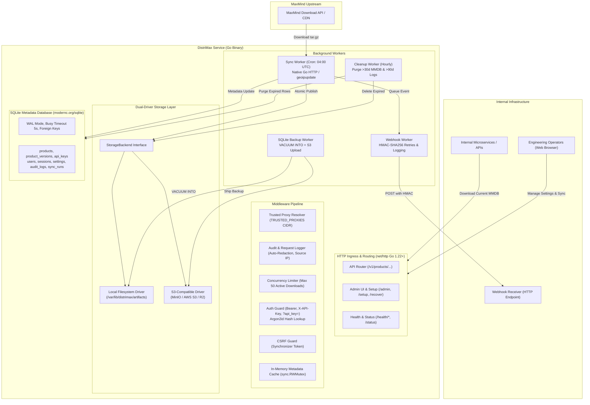
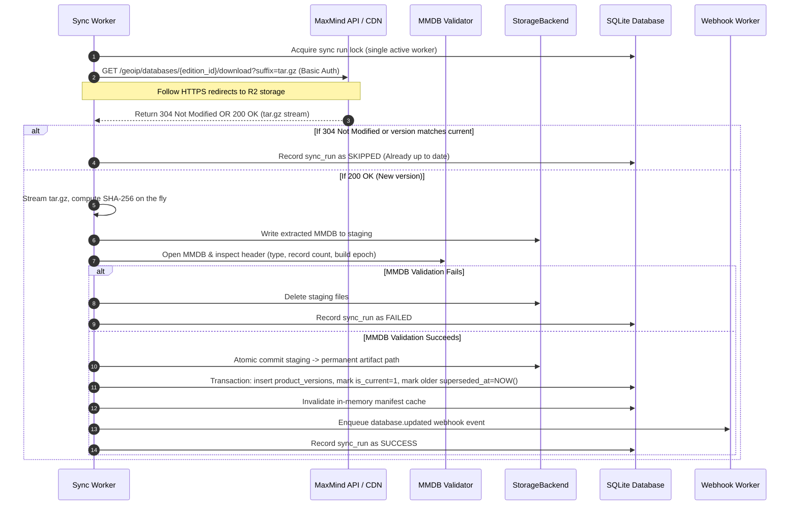

# DistriMax: Internal MaxMind MMDB Distribution Server
## Architectural Specification & Implementation Blueprint

---

## 1. Executive Summary

**DistriMax** is a secure, single-tenant, high-performance internal distribution server written in Go for MaxMind GeoLite MMDB databases (GeoLite2-City, GeoLite2-Country, and GeoLite2-ASN). It centralizes upstream downloads from MaxMind, validates artifact integrity atomically, enforces strict compliance with GeoLite data retention terms, and provides authenticated distribution to internal microservices and data pipelines.

This specification synthesizes all architectural requirements and locks in the technical decisions resolved across all architectural interview rounds.

---

## 2. Locked Decisions Matrix

| # | Architecture Decision | Selected Resolution | Implementation Detail |
|---|---|---|---|
| **1** | **Artifact Storage Backend** | **Dual-driver v1 (Filesystem + S3-compatible)** | Modular `StorageBackend` Go interface with both `filesystem` and `s3` (MinIO/AWS S3/Cloudflare R2) implementations in v1. |
| **2** | **SQLite Backup & DR** | **Built-in `VACUUM INTO` snapshots + S3 upload** | Daily/hourly online snapshots saved locally and optionally rotated to the configured S3 bucket. |
| **3** | **Network Boundary & IP Filtering** | **Reverse-Proxy / Ingress delegated** | DistriMax relies on upstream infrastructure (firewalls, reverse proxies, VPC boundaries) for IP filtering. |
| **4** | **First-Run Bootstrap Secret** | **Environment secret (`.env`)** | `DISTRIMAX_BOOTSTRAP_SECRET` gates the one-time `/setup` wizard for initial admin account creation. |
| **5** | **Upstream Sync Mechanism** | **Hybrid / Pluggable (Native Go HTTP default)** | Native streaming HTTPS Go client with redirects, SHA-256 streaming, and tar extraction; optional `geoipupdate` execution. |
| **6** | **Client Authentication** | **Bearer header, `X-API-Key`, and `?api_key=`** | Full support for `Authorization: Bearer <key>`, `X-API-Key`, and query parameters (redacted from logs). |
| **7** | **Initial MMDB Products** | **City, Country, ASN** | Data-driven database records for `geolite-city`, `geolite-country`, and `geolite-asn`. |
| **8** | **Version Access Model** | **Latest-only consumer access** | Public consumers can only download `/current/download`. Historical versions are restricted to Admin UI for rollback. |
| **9** | **Webhook Notifications** | **Generic HMAC-SHA256 Webhook** | Emits `database.updated` events with `DistriMax-Signature` header, exponential backoff, and delivery audit log. |
| **10** | **Audit & Stats Retention** | **90 days retention, UI stats only** | Request and download audit logs stored for 90 days in SQLite. Prometheus endpoint omitted in favor of UI analytics. |
| **11** | **Sync Frequency & Staleness** | **Daily sync at 04:00 UTC, 8-day staleness** | Automated daily checks; alerts and marks readiness degraded if a product's current version exceeds 8 days. |
| **12** | **Artifact Retention & Cleanup** | **30-day compliance purge** | Automated background worker purges superseded versions older than 30 days to strictly satisfy GeoLite terms. |
| **13** | **Go Stack & Runtime** | **Pure Go, Zero CGO** | Go 1.22+ `net/http` enhanced routing, `modernc.org/sqlite` (CGO-free), and static scratch/alpine container builds. |
| **14** | **Deployment Assets** | **Dockerfile, `docker-compose.yml`, `.env.example`** | Clean, self-contained single-container deployment with volume mounts, omitting extraneous third-party services. |
| **15** | **Code Organization** | **Layered `internal/` architecture** | Standard Go packages: `cmd/distrimax/`, `internal/{config,db,storage,auth,syncer,api,ui,workers}`. |
| **16** | **Database Access Pattern** | **Standard `database/sql` + `WithTx`** | Type-safe repository methods with zero external ORM or code-generation dependencies. |
| **17** | **MaxMind Upstream Protocol** | **REST Permalink API with Basic Auth** | `AccountID:LicenseKey` Basic Auth, `If-Modified-Since`, redirect following, and automatic `.sha256` verification. |
| **18** | **Manifest Caching** | **`sync.RWMutex` map + event invalidation** | In-memory thread-safe caching with instant publication invalidation and 60-second TTL safety fallback. |
| **19** | **Admin UI Styling** | **Embedded custom semantic CSS** | Zero npm/node dependencies, responsive layout, dark/light theme, embedded directly via `embed.FS`. |
| **20** | **Testing & Fixtures** | **Full mock suite with valid MMDB tar.gz** | `httptest.Server` upstream mock with embedded valid mock MMDB tar.gz fixtures, temporary file-backed SQLite integration tests, and parallel race-condition tests. |
| **21** | **Trusted Proxy IP Resolution** | **Strict `TRUSTED_PROXIES` CIDR list** | Only trusts `X-Forwarded-For` / `X-Real-IP` if the direct socket connection comes from an authorized proxy CIDR. |
| **22** | **Break-Glass Admin Recovery** | **HTTP `/recover` endpoint** | Dedicated recovery endpoint authenticated via `DISTRIMAX_RECOVERY_SECRET` with rate limiting and audit logging. |
| **23** | **Concurrency & Rate Limiting** | **In-flight semaphore + per-key limits** | Max 50 concurrent active downloads (returns 429 Retry-After) plus per-key token bucket limits in database. |
| **24** | **S3 Backend Configuration** | **Admin UI only (AES-256-GCM encrypted)** | S3 credentials entered and managed exclusively via Admin UI, stored encrypted at rest in SQLite. |
| **25** | **Process Lifecycle & Shutdown** | **Immediate shutdown on SIGINT/SIGTERM** | Cancels contexts immediately, closes DB, relying on HTTP Range headers for clients to resume downloads. |
| **26** | **CSRF Protection** | **Synchronizer Token Pattern** | Cryptographic token tied to admin session, injected into hidden form fields, and verified on all mutating POST requests. |
| **27** | **API Key Scope Boundary** | **Client consumption only** | API keys strictly scoped to downloading MMDB files and reading metadata/products. Admin actions require user sessions. |
| **28** | **Database Schema Migrations** | **Embedded SQL + forward-only** | `embed.FS` SQL files verified against a `schema_migrations` table with SHA-256 checksums; strictly forward-only. |
| **29** | **Initial Baseline Seeding** | **Default products & settings, zero users** | Seeds City, Country, ASN products and system settings, leaving `users` empty to require initial `/setup`. |
| **30** | **API Error Contract** | **Consistent JSON error envelope** | `{"error": {"code": "...", "message": "...", "status": ...}}` across all client APIs. |
| **31** | **UI Layout & Navigation** | **Sidebar + persistent health header** | Left sidebar navigation with a persistent status header showing system health badge, product count, and current user. |
| **32** | **UI Metrics Visuals** | **Server-rendered SVG sparklines** | Pure Go SVG rendering for download activity trends and storage bars without external JavaScript charting libraries. |
| **33** | **Product Screen Actions** | **Inspect, Sync, and Atomic Rollback** | Enable/disable toggle, manual "Sync Now", SHA-256 inspect, MMDB verification, and one-click rollback to retained versions. |
| **34** | **API Key Form Controls** | **Granular permission & CIDR fields** | Display name, product selection (`*` or specific), scopes, rate limit (req/min), expiration date, and client CIDR restriction. |
| **35** | **Settings Live Verification** | **Test buttons for MaxMind, S3, Webhooks** | Immediate connection check buttons with live success/failure status badges before scheduling syncs. |
| **36** | **UI Pagination & Filtering** | **Bookmarkable URL query parameters** | Standard server-side pagination (`?page=1&limit=50`) and status/product filters with zero client JS requirements. |
| **37** | **User Management & Guard** | **Full user admin with last-admin guard** | Create, disable, reset password, revoke sessions, with database guard preventing disabling the last active admin. |
| **38** | **Setup & Recovery Workflow** | **Two-stage `/setup` and `/recover`** | `/setup` locked permanently after initial user creation; `/recover` serves as break-glass emergency reset. |

---

## 3. High-Level System Architecture



---

## 4. Code Organization & Package Boundaries

```text
/workspace/DistriMax/
├── cmd/
│   └── distrimax/
│       └── main.go                 # Entrypoint, dependency wiring, immediate shutdown
├── internal/
│   ├── config/                     # Environment variables, validation, default flags
│   ├── db/                         # modernc.org/sqlite, schema migrations, repositories
│   │   ├── migrations/             # Embedded SQL migration scripts (.sql)
│   │   │   └── 0001_initial_schema.sql
│   │   ├── migrator.go             # Embedded runner with SHA-256 checksum validation
│   │   ├── db.go                   # Connection pool, WAL pragmas, WithTx helper
│   │   ├── products.go             # Product and product_version queries
│   │   ├── api_keys.go             # API key storage, prefix lookup, last used updates
│   │   ├── users.go                # Admin users and session persistence
│   │   ├── settings.go             # Key-value settings with AES-GCM encryption
│   │   └── audit.go                # Request log ingestion and aggregation queries
│   ├── storage/                    # StorageBackend interface and drivers
│   │   ├── storage.go              # StorageBackend interface definition
│   │   ├── filesystem.go           # Local filesystem driver (POSIX atomic moves)
│   │   └── s3.go                   # AWS S3 / MinIO / Cloudflare R2 driver
│   ├── auth/                       # Security, crypto, and session tokens
│   │   ├── argon2.go               # Argon2id password and key hashing
│   │   ├── crypto.go               # AES-256-GCM settings encryption
│   │   ├── session.go              # Cookie sessions, CSRF token creation & validation
│   │   └── apikey.go               # API key generator (`dm_live_...`), prefix extraction
│   ├── syncer/                     # MaxMind synchronization & validation engine
│   │   ├── syncer.go               # Sync orchestrator, mutex lock per product
│   │   ├── maxmind.go              # REST permalink client (Basic Auth, redirects)
│   │   ├── archive.go              # Streaming tar.gz extractor and SHA-256 calculator
│   │   ├── validator.go            # MMDB binary validation via maxminddb-golang
│   │   └── geoipupdate.go          # Optional fallback wrapper for geoipupdate CLI
│   ├── cache/                      # In-memory thread-safe metadata cache
│   │   └── manifest_cache.go       # sync.RWMutex cache with 60s TTL safety net
│   ├── api/                        # HTTP routing, handlers, and middlewares
│   │   ├── router.go               # net/http ServeMux with Go 1.22 pattern matching
│   │   ├── middleware.go           # Audit logger, API key auth, recovery, CORS, rate limiter
│   │   ├── proxy.go                # Trusted proxy CIDR IP resolution
│   │   ├── handlers_manifest.go    # GET /v1/products/{product}/manifest
│   │   ├── handlers_download.go    # GET /v1/products/{product}/download (ETag, Range)
│   │   ├── handlers_health.go      # /health/liveness, /health/readiness, /status
│   │   ├── handlers_setup.go       # /setup first-run wizard
│   │   └── handlers_recover.go     # /recover break-glass admin recovery
│   ├── ui/                         # Server-rendered HTML Admin UI
│   │   ├── ui.go                   # Handler registrations, CSRF validation, flash banners
│   │   ├── templates/              # Embedded HTML templates (dashboard, keys, settings)
│   │   └── static/                 # Embedded semantic CSS and vanilla JS (embed.FS)
│   └── workers/                    # Asynchronous background tasks
│       ├── scheduler.go            # Cron / ticker scheduler
│       ├── cleanup.go              # 30-day MMDB purge and 90-day audit log purge
│       ├── webhook.go              # HMAC-SHA256 signed event dispatcher with retry
│       └── backup.go               # SQLite VACUUM INTO snapshots and S3 upload
├── Dockerfile                      # Multi-stage rootless Alpine build
├── docker-compose.yml              # Single-service container orchestration
└── .env.example                    # Documented configuration variables
```

---

## 5. Storage Abstraction & Dual-Driver Architecture

The service defines a clean Go interface decoupling all file operations from physical storage:

```go
type StorageBackend interface {
    // Write staging artifact and move to permanent version path atomically
    StoreArtifact(ctx context.Context, product string, version string, filename string, r io.Reader, size int64) (storagePath string, err error)
    
    // Stream artifact content to HTTP client (supports Seek for Range requests)
    OpenArtifact(ctx context.Context, storagePath string) (io.ReadSeekCloser, int64, error)
    
    // Purge expired artifact from storage
    DeleteArtifact(ctx context.Context, storagePath string) error
    
    // Verification check that artifact exists and matches byte size
    VerifyArtifact(ctx context.Context, storagePath string, expectedSize int64) error
}
```

### 1. Local Filesystem Driver
*   **Directory Layout**:
    ```text
    /var/lib/distrimax/
      ├── distrimax.sqlite3
      ├── distrimax.sqlite3-wal
      ├── backups/
      │     └── distrimax-20260904-040000.sqlite3
      ├── staging/
      │     └── sync-run-<uuid>/
      │           └── GeoLite2-City.mmdb
      └── artifacts/
            └── geolite-city/
                  └── 2026-09-04/
                        └── GeoLite2-City.mmdb
    ```
*   **Atomic Guarantees**: Downloads unpack into a temporary staging folder on the same physical mount and are committed to `artifacts/<product>/<version>/` using `os.Rename` (atomic POSIX rename).

### 2. S3-Compatible Driver (MinIO / AWS S3 / Cloudflare R2)
*   **Bucket Object Layout**: `artifacts/{product}/{version}/{filename}`
*   **Integrity**: Verifies SHA-256 and content length post-upload before updating the database current version pointer.
*   **Encrypted Configuration**: Managed exclusively through the Admin UI, stored in SQLite encrypted with AES-256-GCM.
*   **No Direct Public URLs**: Client downloads stream through the authenticated DistriMax Go server; no direct pre-signed or public bucket URLs are returned.

---

## 6. Upstream Synchronization Pipeline

The synchronization worker runs daily (default 04:00 UTC) or upon manual trigger from the Admin UI:



---

## 7. Database Schema & Migration Specification

All migrations run automatically on startup using an internal migration runner.

### SQLite Pragmas
```sql
PRAGMA journal_mode = WAL;
PRAGMA busy_timeout = 5000;
PRAGMA foreign_keys = ON;
PRAGMA synchronous = NORMAL;
```

### Table Definitions (`0001_initial_schema.sql`)

```sql
-- Migration tracking table
CREATE TABLE IF NOT EXISTS schema_migrations (
    version INTEGER PRIMARY KEY,
    name TEXT NOT NULL,
    checksum TEXT NOT NULL,
    applied_at TIMESTAMP NOT NULL DEFAULT CURRENT_TIMESTAMP
);

-- Settings table (AES-256-GCM for secrets)
CREATE TABLE IF NOT EXISTS settings (
    key TEXT PRIMARY KEY,
    value TEXT NOT NULL,
    is_encrypted INTEGER NOT NULL DEFAULT 0,
    updated_at TIMESTAMP NOT NULL DEFAULT CURRENT_TIMESTAMP,
    updated_by TEXT NOT NULL
);

-- Admin users (Argon2id password hashes)
CREATE TABLE IF NOT EXISTS users (
    id TEXT PRIMARY KEY,
    username TEXT NOT NULL UNIQUE,
    password_hash TEXT NOT NULL,
    is_disabled INTEGER NOT NULL DEFAULT 0,
    created_at TIMESTAMP NOT NULL DEFAULT CURRENT_TIMESTAMP,
    updated_at TIMESTAMP NOT NULL DEFAULT CURRENT_TIMESTAMP
);

-- Admin sessions
CREATE TABLE IF NOT EXISTS sessions (
    id TEXT PRIMARY KEY,
    user_id TEXT NOT NULL REFERENCES users(id) ON DELETE CASCADE,
    expires_at TIMESTAMP NOT NULL,
    created_at TIMESTAMP NOT NULL DEFAULT CURRENT_TIMESTAMP,
    last_active_at TIMESTAMP NOT NULL
);
CREATE INDEX IF NOT EXISTS idx_sessions_expires_at ON sessions(expires_at);

-- Products catalog
CREATE TABLE IF NOT EXISTS products (
    id TEXT PRIMARY KEY,             -- e.g. "geolite-city"
    edition_id TEXT NOT NULL UNIQUE, -- e.g. "GeoLite2-City"
    display_name TEXT NOT NULL,
    artifact_filename TEXT NOT NULL, -- e.g. "GeoLite2-City.mmdb"
    is_enabled INTEGER NOT NULL DEFAULT 1,
    sync_schedule_cron TEXT NOT NULL DEFAULT "0 4 * * *",
    retention_days INTEGER NOT NULL DEFAULT 30,
    staleness_days INTEGER NOT NULL DEFAULT 8,
    created_at TIMESTAMP NOT NULL DEFAULT CURRENT_TIMESTAMP,
    updated_at TIMESTAMP NOT NULL DEFAULT CURRENT_TIMESTAMP
);

-- Product versions
CREATE TABLE IF NOT EXISTS product_versions (
    id TEXT PRIMARY KEY,
    product_id TEXT NOT NULL REFERENCES products(id),
    version TEXT NOT NULL,
    released_at TIMESTAMP NOT NULL,
    sha256 TEXT NOT NULL,
    size_bytes INTEGER NOT NULL,
    storage_backend TEXT NOT NULL,   -- "filesystem" or "s3"
    storage_path TEXT NOT NULL,
    is_current INTEGER NOT NULL DEFAULT 0,
    superseded_at TIMESTAMP,
    cleanup_deadline TIMESTAMP,
    is_deleted INTEGER NOT NULL DEFAULT 0,
    created_at TIMESTAMP NOT NULL DEFAULT CURRENT_TIMESTAMP
);
CREATE UNIQUE INDEX IF NOT EXISTS idx_product_versions_unique ON product_versions(product_id, version);
CREATE INDEX IF NOT EXISTS idx_product_versions_cleanup ON product_versions(is_current, is_deleted, cleanup_deadline);

-- Client API keys (Downloads and metadata only)
CREATE TABLE IF NOT EXISTS api_keys (
    id TEXT PRIMARY KEY,
    key_prefix TEXT NOT NULL,        -- First 12 characters (e.g. "dm_live_abcd")
    key_hash TEXT NOT NULL UNIQUE,   -- Argon2id hash of entire secret
    display_name TEXT NOT NULL,
    scopes TEXT NOT NULL,            -- "manifest:read,download"
    allowed_products TEXT NOT NULL,  -- "*" or comma-separated products
    rate_limit_per_min INTEGER NOT NULL DEFAULT 60,
    is_revoked INTEGER NOT NULL DEFAULT 0,
    expires_at TIMESTAMP,
    last_used_at TIMESTAMP,
    last_used_ip TEXT,
    created_at TIMESTAMP NOT NULL DEFAULT CURRENT_TIMESTAMP
);
CREATE INDEX IF NOT EXISTS idx_api_keys_prefix ON api_keys(key_prefix);

-- Request audit logs (90-day retention)
CREATE TABLE IF NOT EXISTS request_audit_logs (
    id TEXT PRIMARY KEY,
    timestamp TIMESTAMP NOT NULL DEFAULT CURRENT_TIMESTAMP,
    source_ip TEXT NOT NULL,
    method TEXT NOT NULL,
    path TEXT NOT NULL,              -- Sanitized (tokens and passwords redacted)
    status INTEGER NOT NULL,
    duration_ms INTEGER NOT NULL,
    bytes_sent INTEGER NOT NULL,
    api_key_id TEXT REFERENCES api_keys(id) ON DELETE SET NULL,
    product_id TEXT,
    version TEXT,
    user_agent TEXT,
    failure_reason TEXT
);
CREATE INDEX IF NOT EXISTS idx_audit_logs_timestamp ON request_audit_logs(timestamp);
CREATE INDEX IF NOT EXISTS idx_audit_logs_product ON request_audit_logs(product_id, timestamp);
CREATE INDEX IF NOT EXISTS idx_audit_logs_api_key ON request_audit_logs(api_key_id, timestamp);

-- Baseline Seeding
INSERT OR IGNORE INTO products (id, edition_id, display_name, artifact_filename, is_enabled, retention_days, staleness_days)
VALUES
  ('geolite-city', 'GeoLite2-City', 'GeoLite2 City', 'GeoLite2-City.mmdb', 1, 30, 8),
  ('geolite-country', 'GeoLite2-Country', 'GeoLite2 Country', 'GeoLite2-Country.mmdb', 1, 30, 8),
  ('geolite-asn', 'GeoLite2-ASN', 'GeoLite2 ASN', 'GeoLite2-ASN.mmdb', 1, 30, 8);

INSERT OR IGNORE INTO settings (key, value, is_encrypted, updated_by)
VALUES
  ('setup_completed', 'false', 0, 'system'),
  ('download_concurrency_limit', '50', 0, 'system'),
  ('audit_retention_days', '90', 0, 'system'),
  ('artifact_retention_days', '30', 0, 'system'),
  ('storage_backend', 'filesystem', 0, 'system');
```

---

## 8. HTTP API & Endpoints Specification

### 1. Consumer Download & Manifest API
*   **Manifest Endpoint**:
    `GET /v1/products/{product}/manifest`
    *   **Headers**: `Authorization: Bearer <key>`, `X-API-Key: <key>`, or `?api_key=<key>`
    *   **Response** (JSON):
        ```json
        {
          "product": "geolite-city",
          "edition_id": "GeoLite2-City",
          "version": "2026-09-04",
          "released_at": "2026-09-04T00:00:00Z",
          "sha256": "4a5c6d8e...",
          "size_bytes": 74523912,
          "filename": "GeoLite2-City.mmdb",
          "download_url": "/v1/products/geolite-city/download"
        }
        ```
*   **Binary Download Endpoint**:
    `GET /v1/products/{product}/download`
    *   **Behavior**: Streams active current MMDB.
    *   **Optimization**: `ETag: "<sha256>"`, `Last-Modified: <released_at>`, `Accept-Ranges: bytes`.
    *   **Limits**: Concurrency limited to 50 active streams. Exceeding returns:
        ```json
        {
          "error": {
            "code": "too_many_requests",
            "message": "Concurrent download limit reached. Please retry shortly.",
            "status": 429
          }
        }
        ```

### 2. Error Response Standard
All client API errors return a uniform JSON envelope:
```json
{
  "error": {
    "code": "invalid_api_key",
    "message": "The provided API key is invalid or has been revoked.",
    "status": 401
  }
}
```

---

## 9. Admin UI Architecture & Screen Specifications

The Administration UI is server-rendered via Go's standard library `html/template`, styled with self-contained, responsive modern CSS embedded directly in the binary via `embed.FS`.

### 1. Navigation & Header Layout
*   **Persistent Header**:
    *   **Health Badge**: Green (`HEALTHY`), Yellow (`DEGRADED - Product Stale`), Red (`UNHEALTHY - DB Locked`).
    *   **Active Products**: Badge count (e.g. `3 Products Active`).
    *   **Current User**: Display username with role tag.
    *   **Logout**: Form button with CSRF protection.
*   **Left Sidebar Navigation**:
    *   `Dashboard` (`/admin/dashboard`)
    *   `Products` (`/admin/products`)
    *   `Downloads & Stats` (`/admin/downloads`)
    *   `API Keys` (`/admin/api-keys`)
    *   `Operations` (`/admin/operations`)
    *   `Audit Logs` (`/admin/audit`)
    *   `Users` (`/admin/users`)
    *   `Settings` (`/admin/settings`)

### 2. Dashboard Screen (`/admin/dashboard`)
*   **Product Freshness Cards**:
    *   Product Name (City, Country, ASN) with enabled toggle badge.
    *   Current Version, Release Date, and Age indicator (e.g., "Released 2 days ago").
    *   SHA-256 checksum (truncated with click-to-copy).
    *   File size and storage backend (`filesystem` or `s3`).
    *   "Sync Now" button per product.
*   **System Metrics & Server-Rendered SVG Sparklines**:
    *   Download volume sparkline (requests per hour over the last 24h, rendered as pure SVG `<polyline>`).
    *   Storage capacity usage bar (percentage of disk or bucket usage).
    *   Last backup timestamp and database WAL size.
*   **Recent Activity Table**:
    *   Last 5 sync runs with duration, discovered versions, and outcome badges.

### 3. Products Management Screen (`/admin/products`)
*   **Catalog Table**:
    *   Edition ID, internal product ID, status (Enabled/Disabled toggle).
    *   Staleness threshold (e.g. 8 days) and retention window (30 days).
*   **Version History Drawer/Table**:
    *   Shows active version with `CURRENT` badge.
    *   Lists superseded historical versions still retained.
    *   Countdown to compliance deletion (e.g., "Deletes in 14 days").
    *   **Rollback Button**: Promoting a retained historical version back to `is_current = 1` atomically in SQLite and invalidating the manifest cache.
    *   **Verify Button**: In-place integrity check recomputing SHA-256 and MMDB metadata.

### 4. API Keys Management Screen (`/admin/api-keys`)
*   **Creation Modal / Form**:
    *   `Display Name`: Human-readable client name (e.g. "Payment Gateway K8s").
    *   `Product Restrictions`: Radio for "All Products (*)" or specific product checkboxes.
    *   `Scopes`: Checkboxes for `manifest:read` and `download`.
    *   `Rate Limit`: Requests per minute (default 60).
    *   `Expiration`: Optional expiration date.
    *   `CIDR Restriction`: Optional client IP CIDR allowlist.
*   **"Copy Once" Reveal Screen**:
    *   Displays full token (e.g. `dm_live_9a8b7c6d...`) with a 1-click copy button and warning: *"This token will not be displayed again. Store it securely."*
*   **Keys Table**:
    *   Prefix (`dm_live_9a8b...`), Display Name, Scopes, Rate Limit, Last Used At, Last Used IP, Status.
    *   Revocation button with confirmation prompt.

### 5. Settings Screen (`/admin/settings`)
*   **Upstream MaxMind**:
    *   Account ID and License Key (masked input, AES-256-GCM encrypted in DB).
    *   **"Test MaxMind Credentials"** button: Performs lightweight upstream HEAD check and returns immediate visual status badge.
*   **Storage Backend**:
    *   Driver selection: `Local Filesystem` vs `S3-Compatible Object Store`.
    *   S3 Endpoint, Bucket, Region, Access Key ID, and Secret Access Key (masked, encrypted).
    *   Force Path Style toggle (for MinIO).
    *   **"Test S3 Connection"** button: Validates bucket access and returns status badge.
*   **Schedules & Retentions**:
    *   Sync Cron schedule, staleness threshold (8 days), artifact retention (30 days), audit log retention (90 days).
*   **Webhooks**:
    *   Target URL and HMAC Secret.
    *   **"Send Test Webhook"** button: Emits dummy ping event to verify receiver.

### 6. Operations & Audit Screens
*   `/admin/operations`: Manual triggers for "Run Upstream Sync", "Trigger Compliance Cleanup", "Create SQLite Backup", and "Verify Artifact Integrity", with real-time feedback.
*   `/admin/audit` & `/admin/downloads`: Server-rendered table with bookmarkable URL pagination (`?page=1&limit=50`) and filter dropdowns (`?status=401&product=geolite-city`).

### 7. Users Screen (`/admin/users`)
*   Create new admin user (Argon2id password hashing).
*   Change password, disable/enable user, revoke sessions.
*   **Safety Guard**: Disallow disabling the sole active administrator account.

### 8. Setup & Recovery Workflows
*   `/setup`: One-time wizard enforcing `DISTRIMAX_BOOTSTRAP_SECRET` to create the initial admin user; locked permanently once completed.
*   `/recover`: Emergency break-glass route authenticated via `DISTRIMAX_RECOVERY_SECRET` to reset administrative access if locked out.

---

## 10. Background Workers & Resilience

### 1. Cleanup Worker (Hourly)
*   **Compliance Enforcer**: Checks `product_versions` where `is_current = 0` and `cleanup_deadline <= CURRENT_TIMESTAMP`.
*   Purges physical MMDB file from `StorageBackend` (filesystem or S3).
*   Updates database record: `is_deleted = 1`, `storage_path = NULL`.
*   **Audit Purge**: Deletes `request_audit_logs` older than 90 days.

### 2. Webhook Worker
*   Dispatches HTTP POST when `database.updated` occurs:
    ```json
    {
      "event": "database.updated",
      "event_id": "9b1deb4d-3b7d-4bad-9bdd-2b0d7b3dcb6d",
      "occurred_at": "2026-09-04T04:05:12Z",
      "product": "geolite-city",
      "version": "2026-09-04",
      "released_at": "2026-09-04T00:00:00Z",
      "sha256": "4a5c6d8e...",
      "size_bytes": 74523912,
      "download_path": "/v1/products/geolite-city/download"
    }
    ```
*   **Signature Header**: `DistriMax-Signature: t=1757000000,v1=<hex(hmac_sha256(payload, secret))>`.
*   **Retry Policy**: Exponential backoff with jitter (5 retries max).

### 3. Backup & DR Worker (Daily)
*   Executes SQLite online snapshot:
    `VACUUM INTO '/var/lib/distrimax/backups/distrimax-<timestamp>.sqlite3'`
*   If S3 storage is enabled, ships the backup snapshot to `s3://<bucket>/backups/distrimax-<timestamp>.sqlite3`.
*   Retains the last 7 daily backup snapshots, purging older snapshots.

---

## 11. Deployment & Packaging Specification

### Rootless Multi-Stage `Dockerfile`
```dockerfile
# Stage 1: Build
FROM golang:1.22-alpine AS builder
WORKDIR /app
RUN apk add --no-cache git
COPY go.mod go.sum ./
RUN go mod download
COPY . .
RUN CGO_ENABLED=0 GOOS=linux go build -ldflags="-s -w" -o /app/distrimax ./cmd/distrimax

# Stage 2: Final Minimal Runtime
FROM alpine:3.20
RUN apk add --no-cache ca-certificates tzdata \
    && addgroup -S distrimax && adduser -S distrimax -G distrimax \
    && mkdir -p /var/lib/distrimax/artifacts /var/lib/distrimax/staging /var/lib/distrimax/backups \
    && chown -R distrimax:distrimax /var/lib/distrimax

USER distrimax
WORKDIR /var/lib/distrimax

COPY --from=builder /app/distrimax /usr/local/bin/distrimax

EXPOSE 8080
VOLUME ["/var/lib/distrimax"]
ENTRYPOINT ["/usr/local/bin/distrimax"]
```

### `docker-compose.yml`
```yaml
version: "3.8"

services:
  distrimax:
    build: .
    container_name: distrimax
    restart: unless-stopped
    ports:
      - "8080:8080"
    volumes:
      - distrimax_data:/var/lib/distrimax
    env_file:
      - .env

volumes:
  distrimax_data:
    driver: local
```

### `.env.example`
```env
# Infrastructure & Storage
HTTP_BIND_ADDRESS=:8080
SQLITE_PATH=/var/lib/distrimax/distrimax.sqlite3
ARTIFACT_ROOT=/var/lib/distrimax/artifacts
STAGING_ROOT=/var/lib/distrimax/staging
BACKUP_ROOT=/var/lib/distrimax/backups

# First-Run Setup & Break-Glass Recovery
DISTRIMAX_BOOTSTRAP_SECRET=change-this-to-a-very-strong-bootstrap-secret
DISTRIMAX_RECOVERY_SECRET=change-this-to-a-very-strong-recovery-secret

# Encryption key for sensitive database settings (32-byte hex for AES-256)
SETTINGS_ENCRYPTION_KEY=0123456789abcdef0123456789abcdef0123456789abcdef0123456789abcdef

# Trusted Proxy CIDRs (comma-separated, e.g. 10.0.0.0/8,172.16.0.0/12)
TRUSTED_PROXIES=127.0.0.1/32
```

---

## 12. Implementation Roadmap & Verification Gates

```text
Phase 1: Project Skeleton & Core Interfaces
  ├── Go module initialization (go 1.22)
  ├── StorageBackend interface (filesystem & s3)
  ├── modernc.org/sqlite database connector & migration runner
  └── Baseline tables (settings, users, products, versions, api_keys)
  [Verification Gate: Unit tests for migrations and storage drivers]

Phase 2: Authentication, Security & Setup Engine
  ├── Argon2id hashing & verification
  ├── AES-256-GCM encryption helper for SQLite settings
  ├── First-run /setup handler with bootstrap-secret validation
  ├── /recover break-glass recovery handler
  ├── Session management & CSRF token generator
  └── API key authentication middleware (Bearer, X-API-Key, ?api_key= with auto-redaction)
  [Verification Gate: Concurrency tests on /setup and API key authentication]

Phase 3: MaxMind Sync & Validation Engine
  ├── Native Go HTTP streaming client with HTTPS redirect & gzip/tar reader
  ├── Streaming SHA-256 calculation
  ├── oschwald/maxminddb-golang structure & metadata verification
  ├── Atomic publication transaction & cache invalidation
  └── Optional geoipupdate wrapper adapter
  [Verification Gate: Mock HTTP MaxMind download test with tar.gz validation]

Phase 4: Consumer API & Metadata Caching
  ├── GET /v1/products/{product}/manifest with in-memory caching
  ├── GET /v1/products/{product}/download with ETag, Last-Modified, Range support
  ├── Request audit logger middleware (source IP, duration, bytes, redaction)
  └── Health endpoints (/health/liveness, /health/readiness, /status)
  [Verification Gate: HTTP conditional request tests (304 Not Modified, Range)]

Phase 5: Background Workers & Lifecycle
  ├── Daily cron sync scheduler
  ├── Compliance cleanup worker (30-day purge & 90-day log purge)
  ├── HMAC-SHA256 signed webhook dispatcher with retry backoff
  └── SQLite VACUUM INTO backup snapshot worker
  [Verification Gate: Automated retention purge verification tests]

Phase 6: Embedded Administration UI
  ├── Embedded HTML templates with responsive styling (no external CDNs)
  ├── Dashboard, Products, Downloads stats, API keys, and Settings pages
  └── Operations page (manual sync trigger, cleanup, integrity check)
  [Verification Gate: End-to-end browser / integration tests]

Phase 7: Packaging & Documentation
  ├── Multi-stage rootless Dockerfile & docker-compose.yml
  ├── .env.example with security instructions
  └── Operator Runbook & Compliance documentation
  [Verification Gate: Clean container build and smoke test]
```
